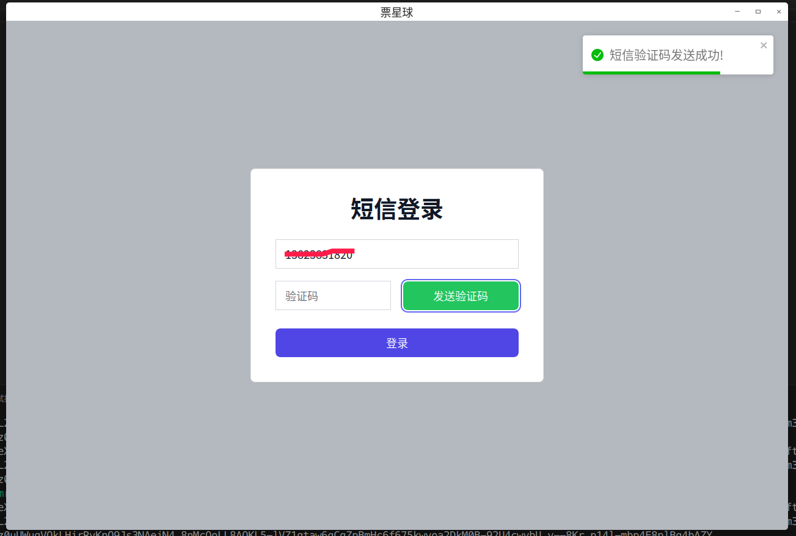
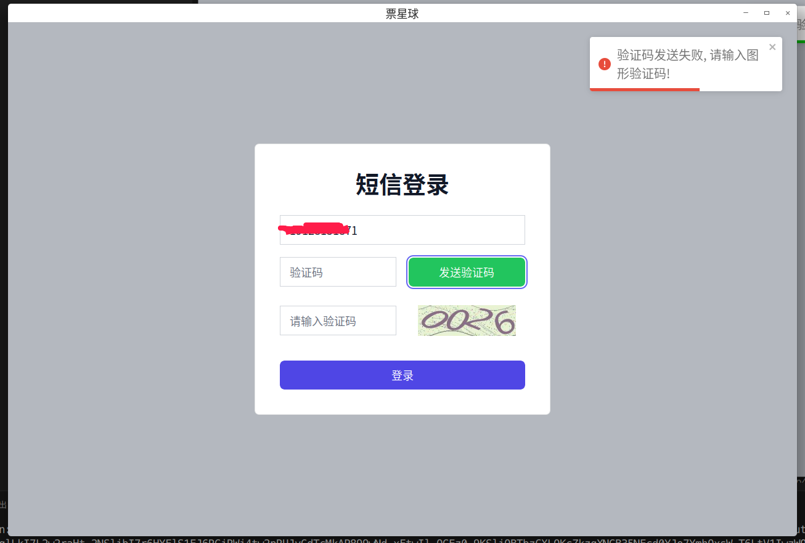
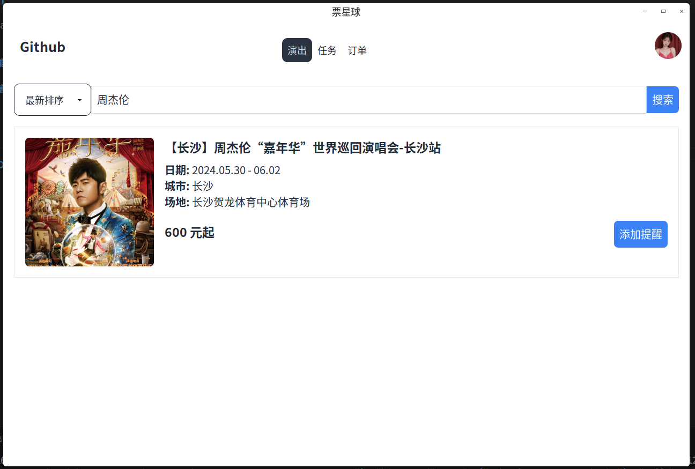
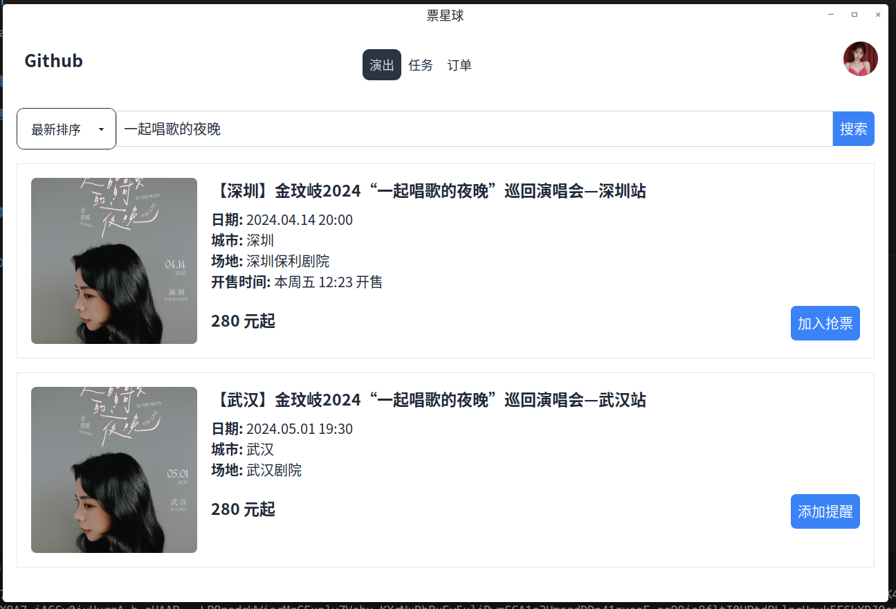
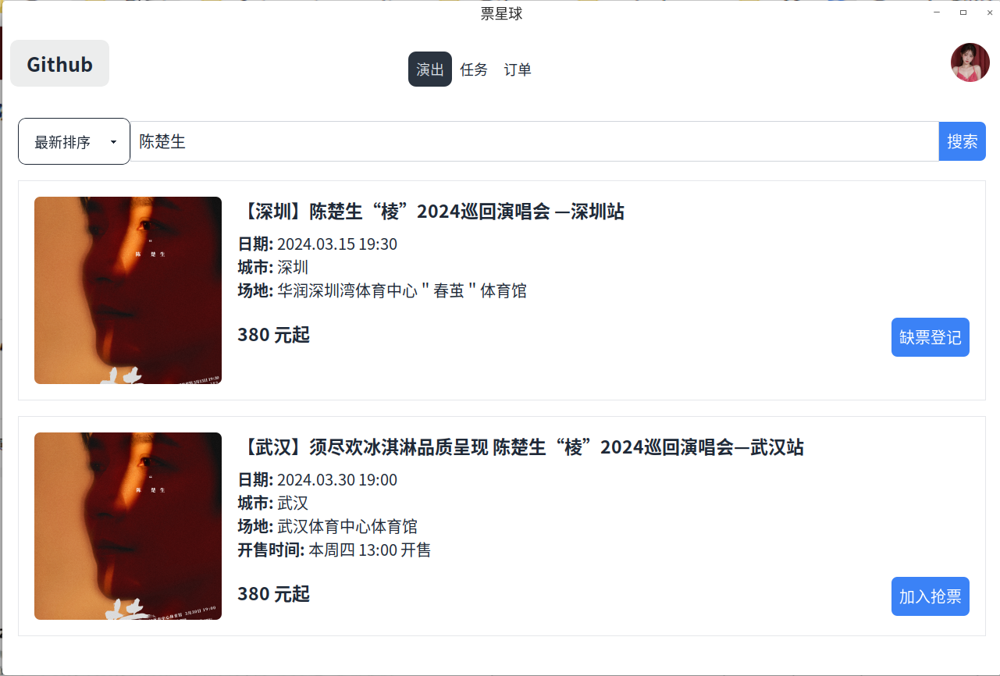
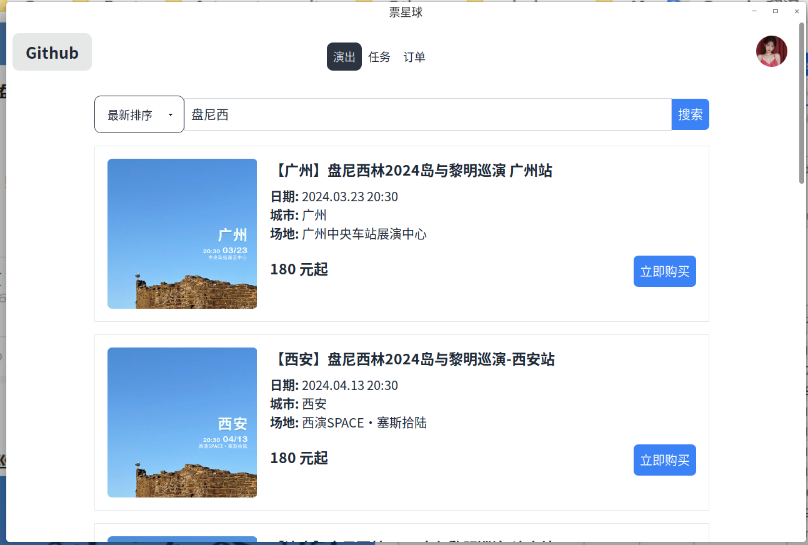
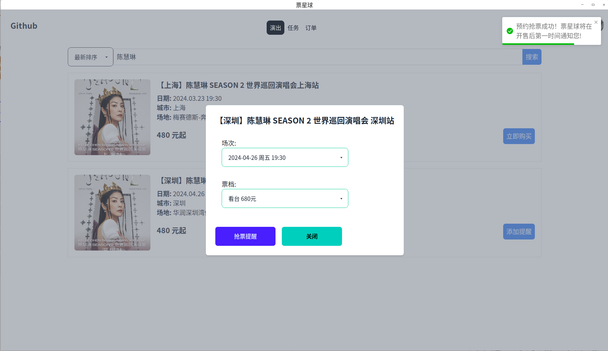
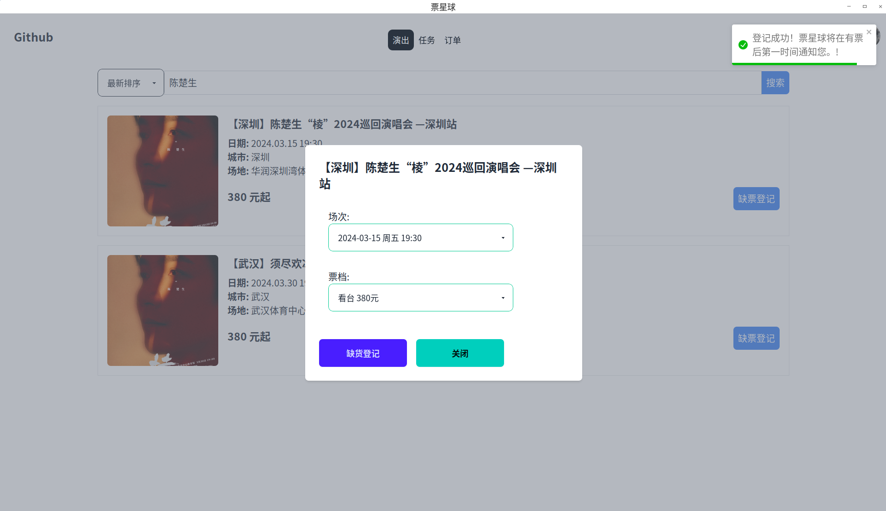
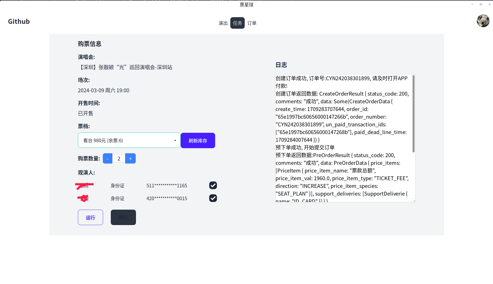

# pxq_ticket(此版有盾)

## 简介

基于 Tauri 开发的跨平台票星球客户端，可在 Linux、Windows 和 macOS 等操作系统上使用。

## 功能展示

### 短信登录

- 无图片验证码:

- 有图片验证码:

### 搜索演出

#### 按钮说明

- 添加提醒: 官方确定会出售此演出的票, 但是未公布开售时间, 添加提醒之后, 当演唱会公布开售日期后会收到提醒短信。

- 缺票登记: 前提条件演出门票已售完, 点击缺票登记, 在有票之后官方会发送短信通知。

- 立即购买: 已开售并且还有剩余票的情况下，可以直接购买。

- 加入抢票: 演出公布了售票日期后, 加入任务等待抢票。

### 任务

- 

### 订单列表

- 

## 使用

### 源码方式运行

### 环境要求
 - [nodejs](https://nodejs.org/en/download/)
 - [rust](https://www.rust-lang.org/zh-CN/tools/install), **Rust安装慢的可以考虑换[字节源](https://rsproxy.cn/#getStarted)**

 - `git clone https://github.com/ClassmateLin/pxq_ticket.git && cd pxq_ticket`

 - `npm install`

 - 运行: `npm run tauri dev`

 - 编译: `npm run tauri build`

### 安装包

 - 直接安装即可。

#### **[TG交流群，非服务群，上帝勿扰, 请认真阅读提示。](https://faka577.site/buy/5)** 

## 特别声明

- 本项目内所有资源文件，禁止任何公众号、自媒体进行任何形式的转载、发布。
- 编写本项目主要目的为学习和研究Rust，无法保证项目内容的合法性、准确性、完整性和有效性。
- 本项目涉及的数据由使用的个人或组织自行填写，本项目不对数据内容负责，包括但不限于数据的真实性、准确性、合法性。使用本项目所造成的一切后果，与本项目的所有贡献者无关，由使用的个人或组织完全承担。
- 本项目中涉及的第三方硬件、软件等，与本项目没有任何直接或间接的关系。本项目仅对部署和使用过程进行客观描述，不代表支持使用任何第三方硬件、软件。使用任何第三方硬件、软件，所造成的一切后果由使用的个人或组织承担，与本项目无关。
- 本项目中所有内容只供学习和研究使用，不得将本项目中任何内容用于违反国家/地区/组织等的法律法规或相关规定的其他用途。
- 所有基于本项目源代码，进行的任何修改，为其他个人或组织的自发行为，与本项目没有任何直接或间接的关系，所造成的一切后果亦与本项目无关。
- 所有直接或间接使用本项目的个人和组织，应24小时内完成学习和研究，并及时删除本项目中的所有内容。如对本项目的功能有需求，应自行开发相关功能。
- 本项目保留随时对免责声明进行补充或更改的权利，直接或间接使用本项目内容的个人或组织，视为接受本项目的特别声明。
